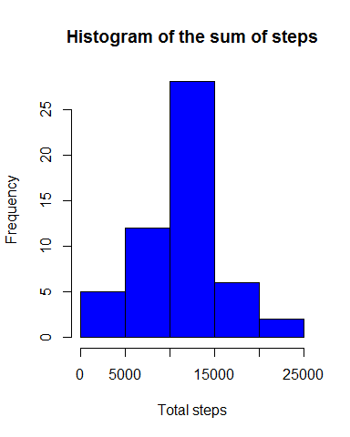
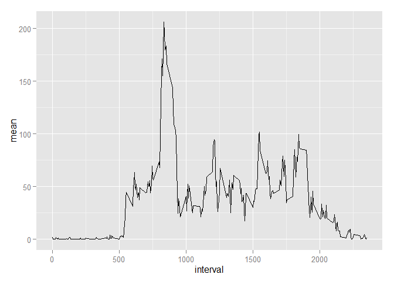
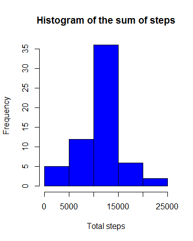
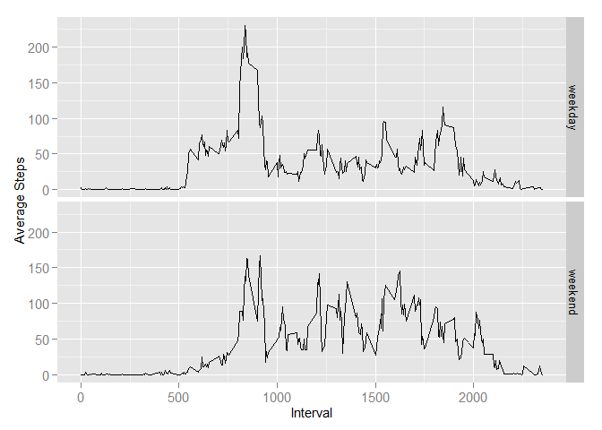

# Reproducible Research: Peer Assessment 1
<br>
<br>

## Loading and preprocessing the data
  

```r
# load the required libraries
library(dplyr)
library(ggplot2)
library(lubridate)
```
<br>
**1. read the file**  

```r
original_data<-read.csv("activity.csv", header=TRUE,colClasses=c("numeric","Date","numeric"))
```
<br>
**2. Process/transform the data (if necessary) into a format suitable for your analysis**  
  
Since the file has NA values, in order to do the necessary calculations it is better to start  
with a set of tidy data, so the original data is purged of na values and stored in step_data

```r
step_data<-original_data[!is.na(original_data$steps),]
```
<br>

## What is mean total number of steps taken per day?  

**1. Make a histogram of the total number of steps taken each day**
First group the data by date and create a sum variable the holds the total steps per day

```r
steps_day<-summarize(group_by(step_data,date),total=sum(steps))
```
And plot the histogram(not to be confused with a bar plot of sum of steps per day)

```r
hist(steps_day$total, xlab="Total steps", col="blue", main="Histogram of the sum of steps")
```

 
<br>
**2. Calculate and report the mean and median total number of steps taken per day**

```r
mean_total<-mean(steps_day$total)
median_total<-median(steps_day$total)
```
The mean is **10766.2**  
The median is **10765.0**  
<br>

## What is the average daily activity pattern?  
<br>
**1. Make a time series plot (i.e. type = "l" ) of the 5minute interval (xaxis) and the average number of steps taken, averaged across all days (yaxis)**  

```r
steps_per_interval<-summarize(group_by(step_data,interval),mean=mean(steps))
g <- ggplot (steps_per_interval, aes (interval, mean))
g + geom_line() 
```

 
<br>
**2. Which 5minute interval, on average across all the days in the dataset, contains the maximum number of steps?**


```r
max_step_interval<-filter(steps_per_interval, mean==max(mean ))$interval
```

This 5 minut interval with the highest average of steps is **835**        
<br>
<br>

## Imputing missing values
<br>
**1. Calculate and report the total number of missing values in the dataset (i.e. the total number of rows with NA s)**  

```r
total_missing<-sum(is.na(original_data$steps))
```

There are **2304** rows with missing step values.  
<br>
**2. Devise a strategy for filling in all of the missing values in the dataset. The strategy does not need to be sophisticated. For example, you could use the mean/median for that day, or the mean for that 5minuteinterval, etc.**  
  
For this the mean of the 5 interval will be used to fill in the missing data, ie: match the intervals and replace the step values that are **na** with the mean for the matching interval.  
<br> 
**3. Create a new dataset that is equal to the original dataset but with the missing data filled in.**  

```r
non_na<-original_data
non_na$steps<-as.double(non_na$steps)
nas<-which(is.na(non_na$steps))
for(i in 1:length(nas)){
  non_na$steps[nas[i]]<-filter(steps_per_interval,interval==non_na$interval[nas[i]])$mean
}
```
*non_na* is the new dataset that has no missing values  
<br>
**4. Make a histogram of the total number of steps taken each day and Calculate and report the mean and median total number of steps taken per day. Do these values differ from the estimates from the first part of the assignment? What is the impact of imputing missing data on the estimates of the total daily number of steps?**  
  
Again we must first group the data by date and create a sum variable the holds the total steps per day

```r
steps_day_nna<-summarize(group_by(non_na,date),total=sum(steps))
```

and plot the histogram  


```r
hist(steps_day_nna$total, xlab="Total steps", col="blue", main="Histogram of the sum of steps")
```

 

Comparing this histogram with the original one with na values removed, the noticeable effect is on the central distribution of highest number of steps between *10,000* and *15,000* steps. There is little or no effect on the other distributions.  

```r
mean_total_nna<-mean(steps_day_nna$total)
median_total_nna<-median(steps_day_nna$total)
```
The mean is **10766.2**  
The median is **10766.2**  
<br>
This means that by adding mean values, and diving by the total of steps, we just approximated the median to the mean(the mean did not change).  
<br>

## Are there differences in activity patterns between weekdays and weekends?  
<br>
**1. Create a new factor variable in the dataset with two levels "weekday" and "weekend" indicating whether a given date is a weekday or weekend day.**  

```r
non_na<-mutate(non_na, day_type=ifelse(wday(as.Date(date)) %in% c(1,7), "weekend","weekday"))
```
The new variable *day_type* was added to the non_na dataset.  
<br>

**2. Make a panel plot containing a time series plot (i.e. type = "l" ) of the 5minute interval (xaxis) and the average number of steps taken, averaged across all weekday days or weekend days (yaxis).**  
first group data by day type, weekend and weekday

```r
day_week_patterns<-summarize(group_by(non_na,day_type,interval),steps=mean(steps))
```
And plot the data in the double chart for comparison of the weekday/weekend activity

```r
g <- ggplot (day_week_patterns, aes (interval, steps))
g + geom_line() + facet_grid (day_type~.) + theme(axis.text = element_text(size = 11), axis.title = element_text(size = 11)) + labs(y = "Average Steps") + labs(x = "Interval")
```

 
<br>
What this shows is that more people run before going to work(intervals 750-1000) during the weekdays but during the weekend they tend to run throughout the day(but still with a good percentage of early risers).
